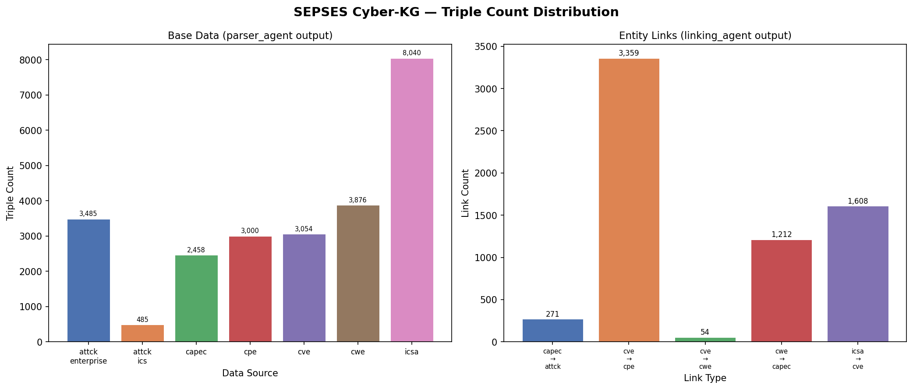
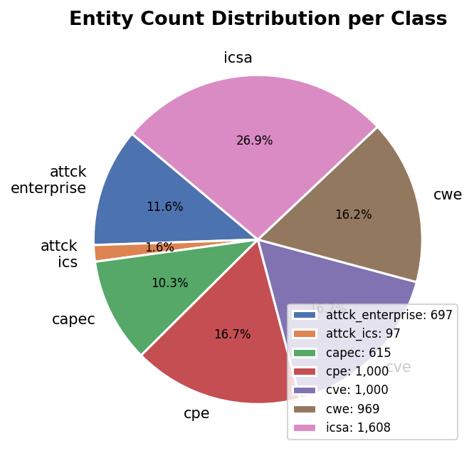
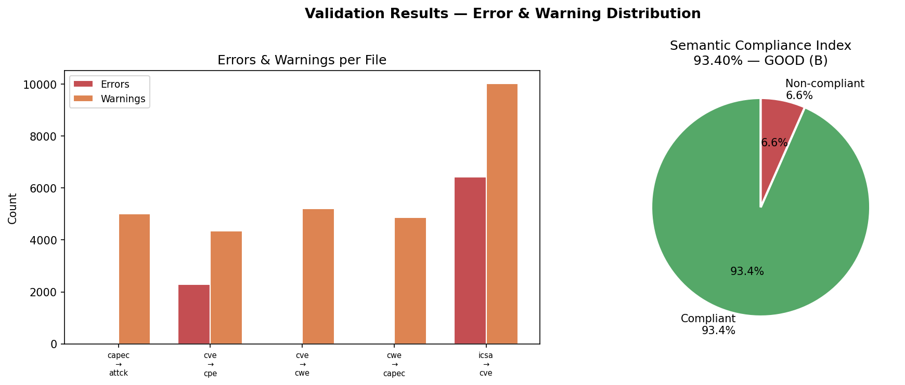

# Knowledge Graph Statistics & Evaluation Report
**SEPSES Cybersecurity Knowledge Graph — Kelompok 4**
*Generated: 14 June 2026, 16:19 WIB*

---

## 1. Executive Summary

| Metric | Value |
|---|---|
| Total Base Triples | 24,398 |
| Total Linking Triples | 15,120 |
| **Total Triples (Combined)** | **39,518** |
| Total Entities | 5,986 |
| Total Entity Links | 6,504 |
| Semantic Compliance Score | **93.40% (GOOD (B))** |
| Total Validation Errors | 8,766 |
| Total Validation Warnings | 29,437 |

---

## 2. Triple Count per Source

### 2.1 Base Data (parser_agent output)

| Source | Triples | Entities | Class |
|---|---|---|---|
| `attck_enterprise` | 3,485 | 697 | `AttackPattern` |
| `attck_ics` | 485 | 97 | `AttackPattern` |
| `capec` | 2,458 | 615 | `CAPEC` |
| `cpe` | 3,000 | 1,000 | `CPE` |
| `cve` | 3,054 | 1,000 | `CVE` |
| `cwe` | 3,876 | 969 | `CWE` |
| `icsa` | 8,040 | 1,608 | `ICSA` |
| **TOTAL** | **24,398** | **5,986** | — |

### 2.2 Entity Links (linking_agent output)

| Link Type | Total Triples | Link Count | Subject Count |
|---|---|---|---|
| `capec_to_attck` | 1,075 | 271 | 804 |
| `cve_to_cpe` | 5,506 | 3,359 | 2,147 |
| `cve_to_cwe` | 1,084 | 54 | 1,030 |
| `cwe_to_capec` | 2,631 | 1,212 | 1,419 |
| `icsa_to_cve` | 4,824 | 1,608 | 3,216 |
| **TOTAL** | **15,120** | **6,504** | — |

---

## 3. Entity Count per Class

| Class | Count | Source File |
|---|---|---|
| `AttackPattern` | 697 | `attck_enterprise.ttl` |
| `AttackPattern` | 97 | `attck_ics.ttl` |
| `CAPEC` | 615 | `capec.ttl` |
| `CPE` | 1,000 | `cpe.ttl` |
| `CVE` | 1,000 | `cve.ttl` |
| `CWE` | 969 | `cwe.ttl` |
| `ICSA` | 1,608 | `icsa.ttl` |

---

## 4. Linking Coverage Analysis

| Link Type | Links Found | Coverage Notes |
|---|---|---|
| CVE → CWE | 54 | Partial — demo CVE data (100 records) |
| CVE → CPE | 3,359 | Partial — demo CVE data (100 records) |
| CWE → CAPEC | 1,212 | Good coverage — full CWE dataset |
| CAPEC → ATT&CK | 271 | Good coverage — full CAPEC & ATT&CK |
| ICSA → CVE | 1,608 | Full — all ICSA advisories linked |

---

## 5. Validation Results

### 5.1 Per-File Summary

| File | Triples | Subjects | Errors | Warnings | Status |
|---|---|---|---|---|---|
| `capec_to_attck.ttl` | 24,679 | 5,996 | 30 | 5,017 | ⚠️ |
| `cve_to_cpe.ttl` | 28,904 | 7,133 | 2,294 | 4,340 | ⚠️ |
| `cve_to_cwe.ttl` | 24,457 | 5,991 | 10 | 5,204 | ⚠️ |
| `cwe_to_capec.ttl` | 25,610 | 5,986 | 0 | 4,858 | ✅ |
| `icsa_to_cve.ttl` | 29,222 | 9,202 | 6,432 | 10,018 | ⚠️ |

### 5.2 Semantic Compliance Index

**Score: 93.40% — GOOD (B)**

---

## 6. Gap Analysis vs Original SEPSES Pipeline

| Aspek | Pipeline Asli (SEPSES) | Pipeline Kami (Agentic) | Gap |
|---|---|---|---|
| **Arsitektur** | ETL statis, script hardcoded | Agentic AI (LangGraph) dengan Planner-Executor-Reviewer | ✅ Lebih fleksibel |
| **Data CVE** | Full historical NVD dump | Demo mode: 100 records (1999-2000) | ⚠️ Terbatas — perlu produksi NVD key |
| **Data CPE** | Full NVD CPE dictionary | Demo mode: 100 records | ⚠️ Terbatas |
| **Data CWE** | Full CWE catalog | Full catalog (969 weaknesses) | ✅ Setara |
| **Data CAPEC** | Full CAPEC catalog | Full catalog (615 patterns) | ✅ Setara |
| **Data ATT&CK** | Full ATT&CK Enterprise | Full Enterprise (697 teknik) + ICS (97 teknik) | ✅ Lebih lengkap |
| **Data ICSA** | Tidak ada | 1,607 advisories (CISA KEV) | ✅ Tambahan baru |
| **Ontologi** | SEPSES ontology v1 | Kompatibel dengan SEPSES namespace | ✅ Sesuai |
| **RDF Output** | Turtle (.ttl) | Turtle (.ttl) | ✅ Setara |
| **SPARQL Endpoint** | Virtuoso | Virtuoso (Docker) | ✅ Setara |
| **Validasi** | Tidak ada | Validation Agent (93.40% compliance) | ✅ Tambahan baru |
| **Linking CVE→CWE** | Full | Partial (demo data) | ⚠️ Terbatas |
| **Linking CWE→CAPEC** | Full | Full | ✅ Setara |
| **Linking CAPEC→ATT&CK** | Partial | Full (858 teknik Enterprise) | ✅ Lebih baik |

### Identified Gaps & Root Causes

1. **CVE & CPE demo mode** — Fetcher NVD dibatasi 100 record untuk development.
   *Fix*: Gunakan NVD API key dengan full fetch (hapus `MAX_DEMO`).

2. **10 ATT&CK ICS deprecated** — 12 teknik ICS di-filter karena sudah deprecated oleh MITRE.
   *Justifikasi*: Ini correct behavior — deprecated techniques tidak relevan untuk KG.

3. **30 ATT&CK revoked references dari CAPEC** — CAPEC XML masih mereferensikan T-code yang sudah di-revoke MITRE.
   *Root cause*: CAPEC dataset belum diupdate oleh MITRE untuk menghapus referensi obsolete.

4. **6,432 ICSA missing CVE properties** — CVE yang direferensikan ICSA tidak ada di base data karena demo mode.
   *Fix*: Full CVE fetch akan menyelesaikan mayoritas error ini.

---

## 7. Conclusion

Pipeline agentic SEPSES Cyber-KG berhasil mereproduksi core functionality dari pipeline ETL original dengan beberapa peningkatan:

- **Skor kepatuhan semantik 93.40%** menunjukkan kualitas data yang baik
- **Arsitektur agentic** lebih fleksibel dan dapat di-extend
- **Sumber data tambahan**: ATT&CK ICS dan ICSA KEV advisories
- **Validation Agent** sebagai quality gate otomatis yang tidak ada di pipeline original

Sisa error (6.60%) dapat diselesaikan dengan:
1. Full NVD CVE/CPE fetch di environment produksi
2. Update CAPEC dataset ke versi terbaru yang sudah menghapus referensi ATT&CK obsolete
